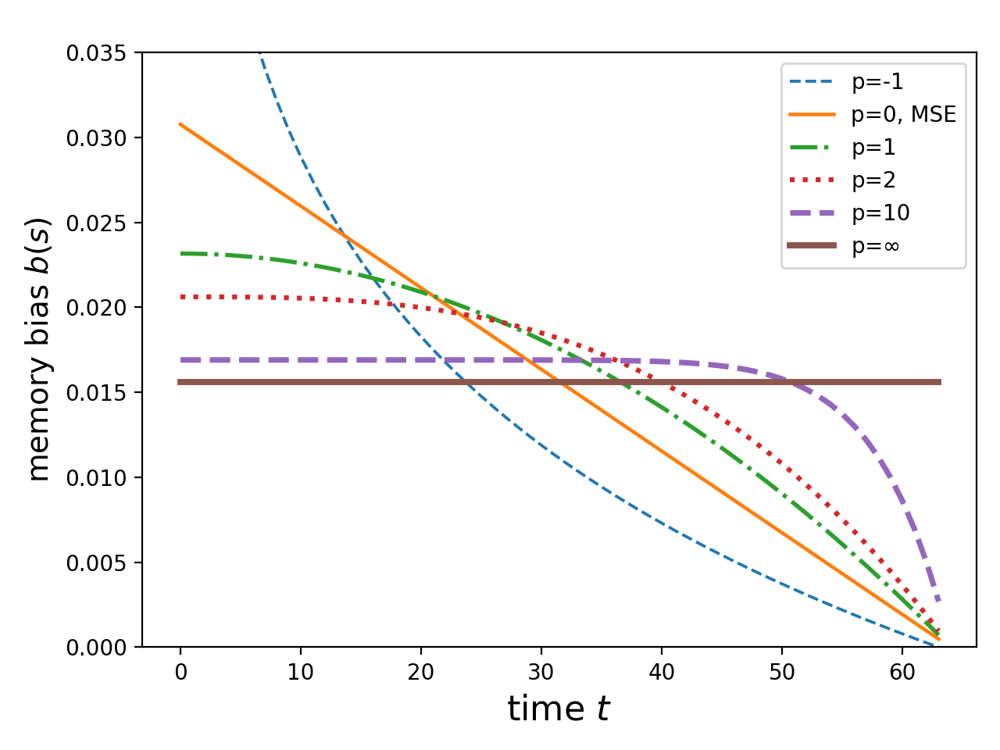

<div align="center">

# INTEREST

Improve loNg-Term mEmoRy lEarning reScaling Temporally

<a href="https://pytorch.org/get-started/locally/"></a>
<a href="https://pytorchlightning.ai/"></a>
<a href="https://hydra.cc/"></a>
<a href="https://github.com/ashleve/lightning-hydra-template"></a><br>
[](https://arxiv.org/abs/2307.11462)
<!-- [](https://papers.nips.cc/paper/2020) -->

</div>

## Temporal weighted error

$$\textrm{Error}^{\textrm{TPE}} = \frac{1}{T} \sum_{t=1}^T w(t) |y(t) - \hat{y}(t)|, \quad w(t) > 0.$$

If we take $w(t)$ to be $w(t) = \frac{1}{t^p}$, the following curves characterize the error functions' temporal bias. 



TODO:

1. Tasks
   1. Synthetic linear functional
   2. Copying problem
   3. Text summarization
2. Models
   1. TCN
   2. Transformer
3. How to tune? 

## Installation

#### Pip

```bash
# clone project
git clone https://github.com/radarFudan/Curse-of-memory
cd Curse-of-memory

# [OPTIONAL] create conda environment
conda create -n myenv python=3.9
conda activate myenv

# install pytorch according to instructions
# https://pytorch.org/get-started/

# install requirements
pip install -r requirements.txt
```

#### Conda

```bash
# clone project
git clone https://github.com/radarFudan/Curse-of-memory
cd Curse-of-memory

# create conda environment and install dependencies
conda env create -f environment.yaml -n myenv

# activate conda environment
conda activate myenv
```

## How to train

```bash
python src/train.py experiment=Lf/lf-rnn.yaml
```

## Future plan

## Refs

### Curse of memory / stable approximation / memory functions

```bibtex
@misc{wang2023improve,
      title={Improve Long-term Memory Learning Through Rescaling the Error Temporally}, 
      author={Shida Wang and Zhanglu Yan},
      year={2023},
      eprint={2307.11462},
      archivePrefix={arXiv},
      primaryClass={cs.LG}
}
```
